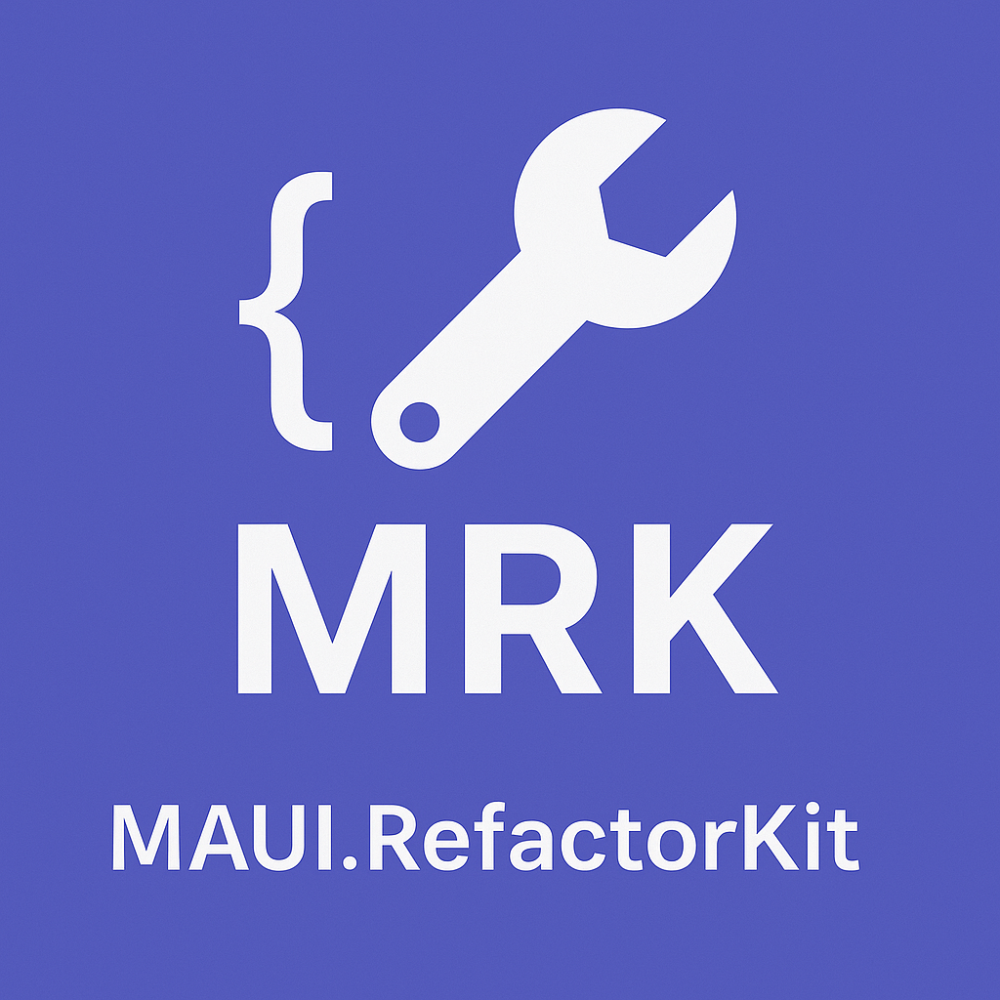

# MRK.MAUI.RefactorKit



**MAUI.RefactorKit** is a Roslyn-based analyzer and code fix provider that helps automate the migration from Xamarin.Forms to .NET MAUI by converting legacy property patterns to the new `ObservableProperty` pattern using `CommunityToolkit.Mvvm`.

---

## ✨ Features

- 🔍 Analyzes Xamarin-style properties.
- 🔧 Automatically refactors them into `ObservableProperty` fields (CommunityToolkit.Mvvm).
- 📦 Packaged as a NuGet analyzer — no manual execution required.
- 🧠 Designed for clean, idiomatic .NET MAUI development.

> **Coming Soon**: Refactoring support for `Command` to `RelayCommand`.

---

## 📦 Installation

Add the NuGet package to your MAUI project:

```bash
dotnet add package MRK.MAUI.RefactorKit
```

Or via Visual Studio NuGet Manager.

## 🛠 Usage

Simply install the package and build your project.

The analyzer will:

- Detect Xamarin-style backing fields and properties.
- Suggest fixes via lightbulb (Ctrl + .) or auto-fix.
- Transform to the ObservableProperty attribute-based syntax.

### Examples

You can find examples of the refactoring in the [README.md](https://github.com/SkJonko/MRK.MAUI.RefactorKit/tree/main/src/MRK.MAUI.RefactorKit/MRK.MAUI.RefactorKit.Package) file of the `MRK.MAUI.RefactorKit.Package` project.


## 📌 Requirements

- .NET MAUI project
- CommunityToolkit.Mvvm installed

## 🤝 Contact
If you have any questions, feedback or a bug to report, feel free to open an issue or contact me direct in my mail 😊

# Made with ❤️ to simplify your MAUI migration.